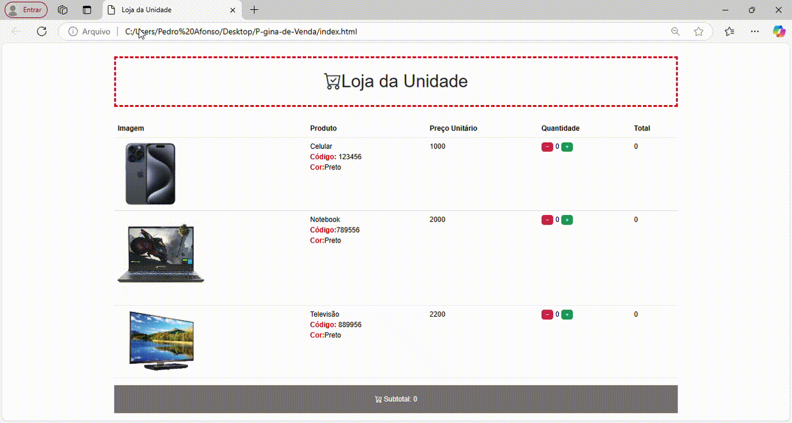

# 🛒 Projeto: Página de Carrinho de Compras  

Este projeto foi desenvolvido durante as aulas de lógica de programação e práticas de programação da **Gran Faculdade**. Ele consiste em uma página web interativa que permite adicionar produtos a um carrinho de compras, proporcionando uma experiência dinâmica para o usuário.  

## 📌 Índice  

- [🎯 Objetivo](#-objetivo)  
- [🛠️ Tecnologias Utilizadas](#️-tecnologias-utilizadas)  
- [🚀 Funcionalidades](#-funcionalidades)  
- [📷 Demonstração](#-demonstração)  
- [📦 Como Executar o Projeto](#-como-executar-o-projeto)  
- [📜 Licença](#-licença)  

---

## 🎯 Objetivo  

O objetivo deste projeto é aplicar os conceitos de lógica de programação e desenvolvimento web na criação de uma funcionalidade essencial para lojas virtuais: um **carrinho de compras**.  

---

## 🛠️ Tecnologias Utilizadas  

Este projeto foi desenvolvido utilizando as seguintes tecnologias:  

- **HTML** → Estrutura da página  
- **CSS** → Estilização da interface  
- **Bootstrap** → Framework para estilização responsiva  
- **JavaScript** → Manipulação dinâmica do carrinho de compras  

---

## 🚀 Funcionalidades  

- ✅ Adicionar produtos ao carrinho  
- ✅ Remover produtos do carrinho  
- ✅ Atualizar a quantidade de produtos  
- ✅ Exibir o valor total da compra  
- ✅ Layout responsivo para diferentes dispositivos  

---

## 📷 Demonstração  


 
---

## 📦 Como Executar o Projeto  

1. **Clone o repositório:**  
   ```bash
   git clone git@github.com:pedrohalarcao/P-gina-de-Venda.git
   
2. **Acesse a pasta do projeto:**

   cd P-gina-de-Venda

## 📜 Licença

Este projeto está sob licença MIT . Consulte o arquivo LICENSE para mais detalhes.   


